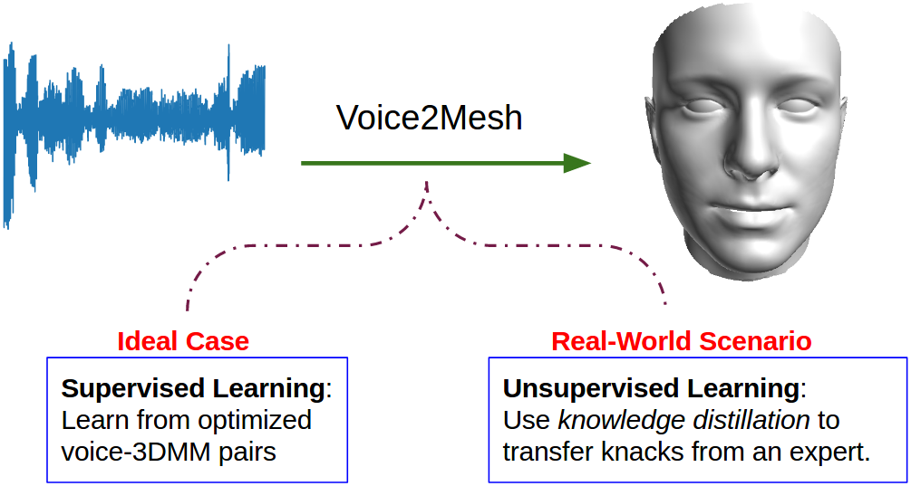
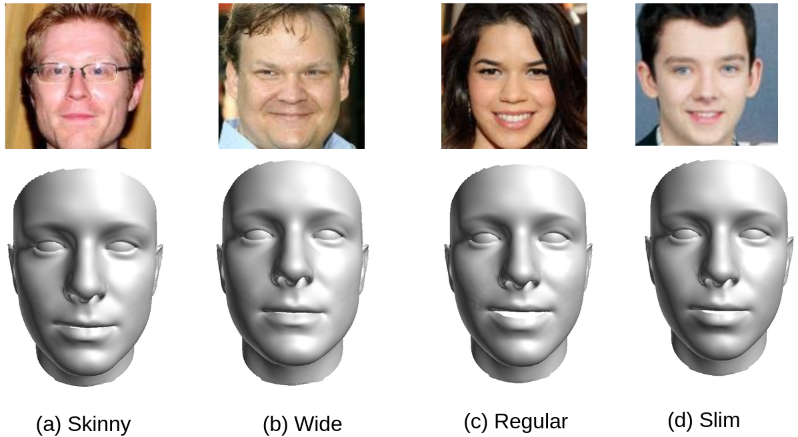
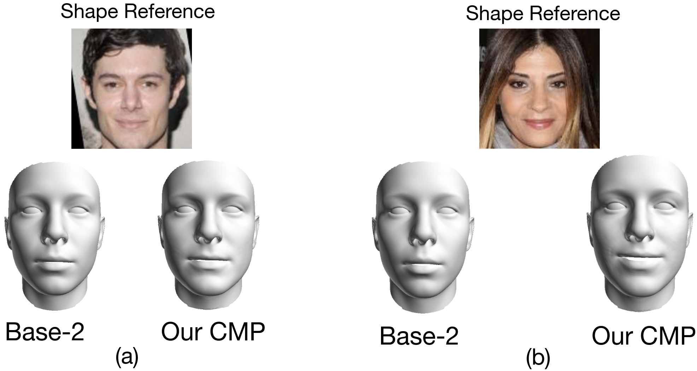

# Voice2Mesh
Arxiv 2021 "Voice2Mesh: Cross-Modal 3D Face Model Generation from Voices"

Cho-Ying Wu, Ke Xu, Chin-Cheng Hsu, Ulrich Neumann, University of Soutjern California

[<a href="https://choyingw.github.io/works/Voice2Mesh/index.html"> Project page </a>]

We study the cross-modal learning and analyze the correlation between voices and 3D face geometry. Unlike previous methods for studying this correlation between voices and faces and only work on  the 2D domain, we choose 3D representation that can better validate the supportive evidence from the physiology of the correlation between voices and skeletal and articulator structures, which potentially affect facial geometry.

Visual results:

 

Codes will be ready soon!
