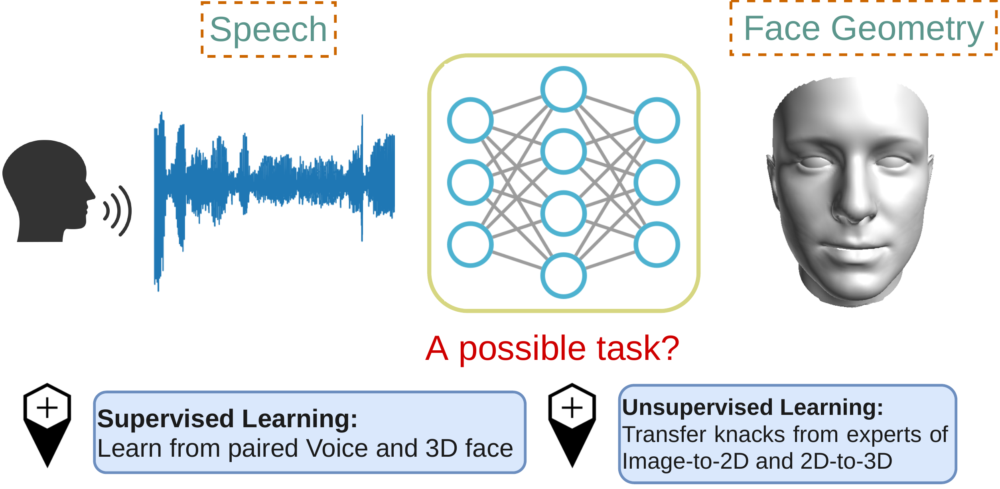

#  <div align="center">Cross-Modal Perceptionist</div>
Code Repository for CVPR 2022 "Cross-Modal Perceptionist: Can Face Geometry be Gleaned from Voices?"

Cho-Ying Wu, Chin-Cheng Hsu, Ulrich Neumann, University of Southern California

[<a href="https://arxiv.org/abs/2203.09824">Paper</a>] [<a href="https://choyingw.github.io/works/Voice2Mesh/index.html">Project page</a>] [<a href="https://drive.google.com/drive/folders/1tT36oDujNXBw5SpwhY3PiBnGIE0FbvCs?usp=sharing">Voxceleb-3D Data</a>]

<b>Check the project page for the introduction of this cool work!</b>

<i>Update: 2022/12/01</i> Added Evaluation code, pretained model, and execution script for supervised framework. Organized data structure of Voxceleb-3D

<i>Voxceleb-3D</i>:

(1) [<a href="https://drive.google.com/file/d/1xBjyP5BiwLL9LCETy0-UJt5oI4bROZVD/view?usp=share_link">Here</a>] contains data with names starting from F-Z as the <b>training set</b>. 100G zipped file, ~250G after unzip. This set contains pointcloud (.xyz), reconstructed mesh overlapped on images from VGGFace (_b.jpg), and 199-dim 3DMM parameters using BFM Face 2009 basis. This is in contrast to simplified 3DMM basis for first 40-dim shape + next 10-dim expression. (SynergyNet follows 3DDFA-v2 and uses the first 40-dim out of 199-dim as the shape code. Thus, the first 40 in 199 correspond to first 40-dim in SynergyNet)You can donwload full basis from BFM-2009 <a href="https://faces.dmi.unibas.ch/bfm/index.php?nav=1-1-0&id=details">official website</a>. There are multiple 3D faces for an identity. 

(2) [<a href="https://drive.google.com/file/d/1BzuNOYN_8USpp6r8uPxpSezD5GOhf1XI/view?usp=share_link">Here</a>] contains data with names starting from A-E as the <b>validation set</b>. 300M. The format is the same except there is only one 3D face for an identity as groundtruth.

(3) [<a href="https://drive.google.com/file/d/1jKOCjIsMlfPln8Vkpjx_wCRC20oVigxT/view?usp=share_link">Here</a>] contains images from VGGFace we used to reconstruct 3D faces for (1) and (2)

(4) [<a href="https://drive.google.com/file/d/1Ac6b3oDB1Ot274u4CU-OaeSlUT5r6bZK/view?usp=share_link">Here</a>] contains preprocessed voice data (MFCC features) from Voxceleb for all the identities. 38G zipped file. Refer to this [<a href="https://drive.google.com/file/d/1h26fBbqeYwgjjwPOZrsshIL0xRcfM6eI/view?usp=share_link">meta file</a>] to map id to name.

(5) [<a href="https://drive.google.com/file/d/1CTDhjZfDOTyUyfknpGKkkz0xXc756Ua0/view?usp=share_link">Here</a>] contains preprocessed voice data (MFCC features) from Voxceleb for the testing subset (A-E). You can download it for inference purpose. See later section.


<p align="center">

</p>

We study the cross-modal learning and analyze the correlation between voices and 3D face geometry. Unlike previous methods for studying this correlation between voices and faces and only work on  the 2D domain, we choose 3D representation that can better validate the supportive evidence from the physiology of the correlation between voices and skeletal and articulator structures, which potentially affect facial geometry.

<ins>Comparison of recovered 3D face meshes with the baseline.</ins>

<p align="center">

</p>

<ins>Consistency for the same identity using different utterances.</ins>

<p align="center">
 
</p>
    
##  <div align="center">Demo: Preprocessed fbank</div>

We test on Ubuntu 16.04 LTS, NVIDIA 2080 Ti (only GPU is supported), and use anaconda for installing packages

Install packages

1. `conda create --name CMP python=3.8`
2. Install PyTorch compatible to your computer, we test on PyTorch v1.9 (should be compatible with other 1.0+ versions)
3. install other dependency: opencv-python, scipy, PIL, Cython, pyaudio

    Or use the environment.yml we provide instead: 
    - `conda env create -f environment.yml`
    - `conda activate CMP`

4. Build the rendering toolkit (by c++ and cython) for overlapping 3D meshes on images with configurations

    ```
    cd Sim3DR
    bash build_sim3dr.sh
    cd ..
    ```

Download pretrained models and 3DMM configuration data

5. Download from [<a href="https://drive.google.com/file/d/1tqTSDrVVL3LkOWN-hduELm3YkWJ2ZUqu/view?usp=sharing">here</a>] (~160M) and unzip under the root folder. This will create 'pretrained_models' (trained by unsupervised CMP) and 'train.configs' (3DMM config data) under the root folder. 

Read the preprocessed fbank for inference 

6. `python demo.py` (This will fetch the preprocessed MFCC and use them as network inputs)
7. Results will be generated under `data/results/` (pre-generated references are under `data/results_reference`)

More preprocessed MFCC and 3D mesh (3DMM params) pairs can be downloaded: [<a href="https://drive.google.com/drive/folders/1tT36oDujNXBw5SpwhY3PiBnGIE0FbvCs?usp=sharing">Voxceleb-3D Data</a>] (about 100G). 

##  <div align="center">Demo: :laughing: Try it! Use device mic input </div>

1. Do the above 1-5 step. Plus, download the <a href="https://drive.google.com/file/d/1pNx8wS5O9QA3nzaToYIKRuUovzFPKkZj/view?usp=sharing">face type meshes</a> and extract under ./face_types

2. `python demo_mic.py` The demo will take 5 seconds recording from your device and predict the face mesh. 

We perform unsupervised gender classfication based on mean male and female shape and calculate the statistics between the predicted face and mean shape. Also we calculate the distance between the four types of faces (Regular, Slim, Skinny, Wide)and indicate which type the voice is closer to.

3. Results will be generated under data/results

##  <div align="center">Inference from supervised framework </div>

1. Do the 1-5 step in Demo. Download pretrained supervised model [<a href="https://drive.google.com/file/d/1dWDwtLpt7wW7VNCJCUKscUEP-mIkRpPo/view?usp=share_link">here</a>]. Download voice data (A-E) for inference [<a href="https://drive.google.com/file/d/1CTDhjZfDOTyUyfknpGKkkz0xXc756Ua0/view?usp=share_link">here</a>], [<a href="https://drive.google.com/file/d/1h26fBbqeYwgjjwPOZrsshIL0xRcfM6eI/view?usp=share_link">meta file</a>], and [<a href="https://drive.google.com/file/d/1NdkqlCPhl-mvPU9TYlPgHE_FaNJjAysf/view?usp=share_link">groundtruth</a>]. Put the pretrained model under './pretrained_models/supervised_64'. Put the vocie data and meta file under './data'. Put the groundtruth under './data' and extract.


2. Edit config.py Line 6: change to 'pretrained_models/supervised_64'

3. 
    ```
    python eval_sup.py
    ```

This will match identity from voiceID and available 3D faces reconstructed from VGGFace via the meta file. Only predict 3D faces for those matched ID. Then it will save all the mesh obj files under './data/supervised_output/'

##  <div align="center">Evaluation </div>

1. Do the 1-5 step in Demo. Download generated and saved mesh for validation set (name starting from A-E in Voxceleb-3D). From supervised CMP: https://drive.google.com/file/d/1_xobyRM-abjfrvzjbF7uwMVPFPfeKZC9/view?usp=share_link; 

(The same as groundtruth in the supervised inference) Voxceleb-3D validation set: https://drive.google.com/file/d/1NdkqlCPhl-mvPU9TYlPgHE_FaNJjAysf/view?usp=share_link. Put them under './data' and extract.

The valiation set for each identity contains image (.jpg), mesh (.obj), pointcloud (.xyz), image overlapped with mesh (_b.jpg), 3DMM parameters (.npy) (199-dim for shape and 29-dim for expression. This is in contrast to simplified 3DMM basis for 40-dim shape and 10-dim expression. You can donwload full basis from BFM-2009 <a href="https://faces.dmi.unibas.ch/bfm/index.php?nav=1-1-0&id=details">official website</a>. Otherwise, we provided already reconstructed mesh in obj extension)

2. 
    ```
    bash cal_size.sh
    ```

This will run and report ARE metrics and keypoint error metrics.

##  <div align="center">Training </div>

1. Train the unsupervised framework

-- Download 'Voxceleb-3D' data (2), (3), and (4). They are validation set, training images, and training voice banks. Extract and put them under './data'

-- Download a much smaller set <a href="https://drive.google.com/file/d/1TkGCd2aACqUXVYsELnd6JTPM6ErRveQC/view?usp=sharing">[here]</a> for fast online validation

-- python gan_train_cascade.py

##  <div align="center">Citation</div>
If you find our work useful, please consider to cite us.

    @inproceedings{wu2022cross,
    title={Cross-Modal Perceptionist: Can Face Geometry be Gleaned from Voices?},
    author={Wu, Cho-Ying and Hsu, Chin-Cheng and Neumann, Ulrich},
    booktitle={CVPR},
    year={2022}
    }


This project is developed on [<a href="https://github.com/choyingw/SynergyNet">SynergyNet</a>], [<a href="https://github.com/cleardusk/3DDFA_V2">3DDFA-V2</a>] and [<a href="https://github.com/cmu-mlsp/reconstructing_faces_from_voices">reconstruction-faces-from-voice</a>]
